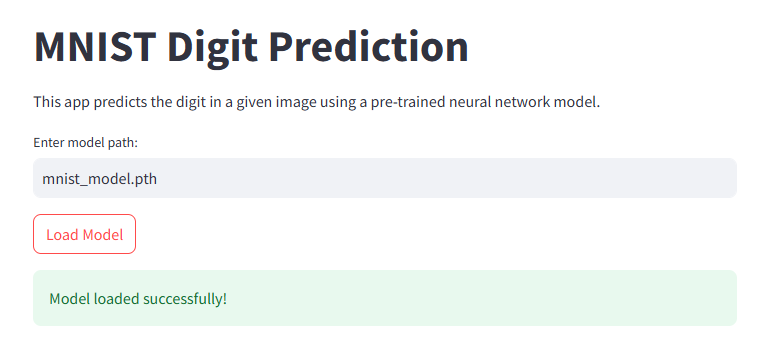
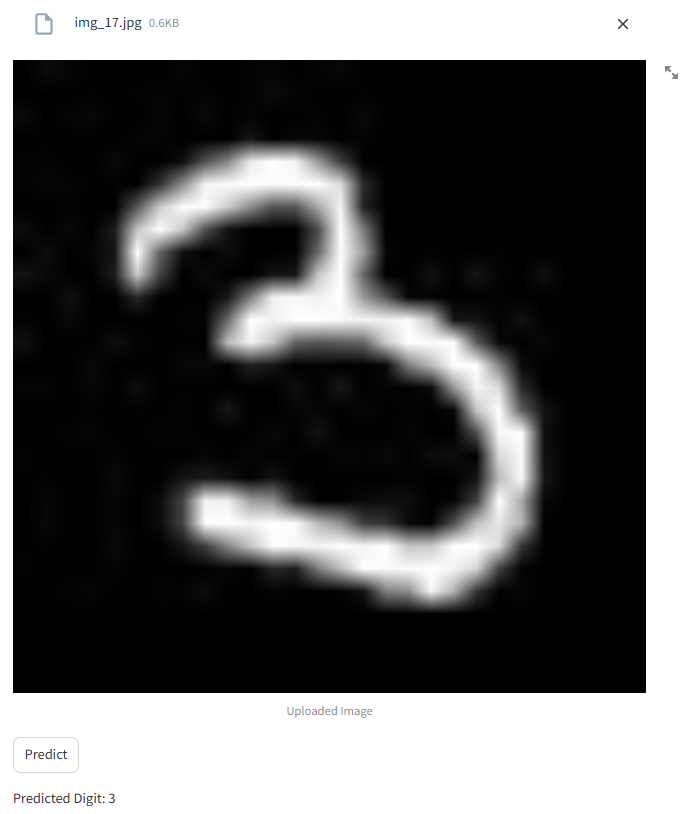

# MNIST Digit Classification with PyTorch

## Project Overview
This project implements a neural network for digit classification using the MNIST dataset. The model is built with PyTorch and achieves approximately 97% accuracy in recognizing handwritten digits. Additionally, the project includes a Streamlit application for interactive model deployment.

## Features
- Neural network with multiple layers
- Data normalization
- Train/validation/test split
- Cross-entropy loss
- Stochastic Gradient Descent (SGD) optimizer
- Interactive Streamlit application for digit prediction

## Requirements
- Python 3.7+
- PyTorch
- NumPy
- Matplotlib
- scikit-learn
- Streamlit

## Installation
Install the required libraries using pip:
```bash
pip install torch numpy matplotlib scikit-learn streamlit
```

## Dataset
- MNIST-120k dataset
- 120,000 handwritten digit images
- 28x28 pixel grayscale images
- 10 classes (digits 0-9)
- Link : https://www.kaggle.com/datasets/fedesoriano/qmnist-the-extended-mnist-dataset-120k-images

## Model Architecture
- Input Layer: 784 neurons (28x28 flattened image)
- Hidden Layer 1: 128 neurons with ReLU activation
- Hidden Layer 2: 64 neurons with ReLU activation
- Output Layer: 10 neurons (one per digit)

## Training Parameters
- Epochs: 15
- Batch Size: 32
- Learning Rate: 0.001
- Optimizer: SGD with momentum

## Performance
- Training Accuracy: ~97%
- Validation Accuracy: 97.15%
- Test Accuracy: 97.00%

## Usage
### Streamlit Application
Run the Streamlit application for interactive digit prediction:
```python
streamlit run app.py
```
- Features:
  - Load a pre-trained model (mnist_model.pth).
  - Upload a handwritten digit image (e.g., .png, .jpg).
  - View the uploaded image.
  - Predict the digit using the model.

```python
model = load_model("mnist_model.pth")

# Predict a single image
prediction = test_single_image(model, single_image)
print(f"Predicted Digit: {prediction}")
```
### Streamlit Interface
  - Enter Model Path: Provide the path to the pre-trained model (default: mnist_model.pth).
  - Upload Image: Upload a grayscale image of a handwritten digit (28x28 pixels preferred).
  - Predict: Displays the predicted digit and its confidence score.
## Result



## Future Improvements
- Experiment with deeper architectures
- Try different optimizers
- Implement data augmentation

## License
MIT License

## Acknowledgments
- MNIST Dataset
- PyTorch Community
